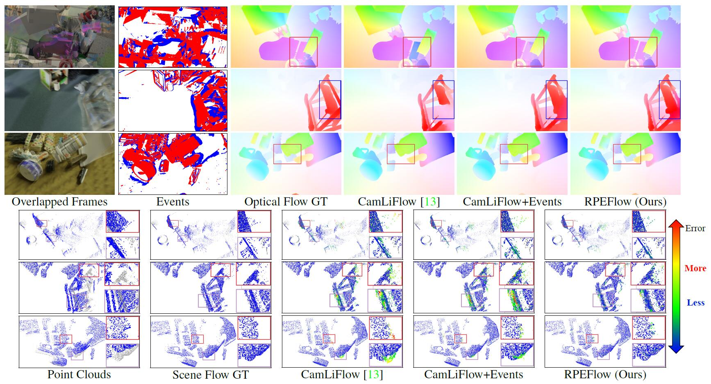

## RPEFlow: Multimodal Fusion of RGB-PointCloud-Event for Joint Optical Flow and Scene Flow Estimation (ICCV 2023)

[Project Page](https://npucvr.github.io/RPEFlow/), [arXiv](https://arxiv.org/abs/xxx), [IEEE](https://ieeexplore.ieee.org/document/xxx), [Supp](https://github.com/danqu130/RPEFlow/releases/download/supp/RPEFlow-supp.pdf). (Waiting for updates)



### Environment
```
CUDA 11.7
CUDNN 8.5.0
torch 1.13.0
torchvision 0.14.0
pip install opencv-python tensorboard h5py imageio omegaconf
```

Compile CUDA extensions from [CamLiFlow](https://github.com/MCG-NJU/CamLiFlow) for faster training and evaluation:
```
cd models/csrc
python setup.py build_ext --inplace
```

### Dataset
#### FlyingThings3D
If you just want to run this project, just download our pre-processed files [here](https://drive.google.com/file/d/1irf6ypWR2dmugHuDgTCkndTxdwohZpHT/view?usp=sharing). 
```
dataset/FlyingThings3D_subset_pc
├── train_preprocess_ev10_1
├── val_preprocess_ev10_1
```

<details><summary> Optional. If it doesn't meet your needs, </summary>
you should first download the raw <a href="https://lmb.informatik.uni-freiburg.de/resources/datasets/SceneFlowDatasets.en.html" target="_blank">FlyingThings3D_subset</a> dataset and perform the event simulation (with <a href=https://github.com/uzh-rpg/rpg_vid2e target="_blank">esim_py</a>, currently not available) and point cloud generation steps. The point cloud generation process follows 
<a href="https://github.com/MCG-NJU/CamLiFlow/blob/main/preprocess_flyingthings3d_subset.py" target="_blank">CamLiFlow</a>.

<pre><code>python preprocess_flyingthings3d_subset.py # from https://github.com/MCG-NJU/CamLiFlow/blob/main/preprocess_flyingthings3d_subset.py
python scripts/convert_flyingthings3d_subset_hdf5.py --input_dir dataset/FlyingThings3D_subset_pc
</code></pre>
</details>

#### EKubric
If you just want to run this project, just download our pre-processed files [here](https://drive.google.com/drive/folders/11cUX2083P-WLaXuw-BfAZpvNbb1VnU9v). 
```
dataset/ekubric/
├── sf_preprocess
```

<details><summary> Optional. If it doesn't meet your needs, </summary>
you should first download the raw <a href="https://drive.google.com/drive/folders/1znj0EqCn5CkaBYhRqrOqnHSKKexhVhIX" target="_blank">EKubric</a> dataset and perform the point cloud generation and preprocess step.

<pre><code>dataset/ekubric/
├── backward_flow
├── depth
├── events_i50_c0.15
├── forward_flow
├── metadata
├── rgba
├── segmentation
</code></pre>
<pre><code>python convert_kubric_hdf5.py --input_dir dataset/ekubric
</code></pre>
</details>

#### DSEC
If you just want to run this project, just download our pre-processed files [here](https://drive.google.com/file/d/1CyEbgqBU1VXdohHWPkd7ForKlZZL9n-D/view).
```
dataset/DSEC/
├── train_preprocess_pc
``` 
Since there is no ground truth flow for the official test set, we can only divide the official training set into a `train` set and a `val` set. See [TRAIN_SEQUENCE](./dsec.py#L207) for details.

<details><summary> Optional. If it doesn't meet your needs, </summary>
you should first download the raw <a href="https://dsec.ifi.uzh.ch/dsec-datasets/download/" target="_blank">DSEC</a> dataset and perform the disparity and aligned image (<a href="https://github.com/uzh-rpg/DSEC/issues/25" target="_blank">Events and frame alignment</a>) generation steps.
Note that the disparity here is not the official sparse disparity, but is computed using the stereo matching model <a href="https://github.com/gallenszl/CFNet" target="_blank">CFNet</a>.
<pre><code>dataset/DSEC/
├── train
│   ├── thun_00_a 
│       ├── calibration
│       ├── disparity
│       ├── events
│       ├── flow
│       └── images
...
├── train_events.zip
├── train_images.zip
├── train_optical_flow.zip
├── train_calibration.zip
</code></pre>
</details>

### Evaluation

#### Weights

First download our pre-trained model weights [here](https://drive.google.com/drive/folders/19kzbea7C51kvjxnSQAsYeavZFmARrkfA?usp=drive_link) and place them in the ```checkpoints``` folder.

#### Things

```
python eval_withocc.py --config ./conf/test/things.yaml --weights ./checkpoints/RPEFlow_things.pt
```

<details><summary> Results </summary>
<pre><code>#### 2D Metrics ####
EPE: 1.402
1px: 86.22%
Fl:  5.75%
#### 3D Metrics ####
EPE: 0.042
5cm: 88.00%
10cm: 93.08%
#### 3D Metrics (Non-occluded) ####
EPE: 0.024
5cm: 93.14%
10cm: 96.72%
</code></pre>
</details>


#### EKubric
```
python eval_withocc.py --config ./conf/test/ekubric.yaml --weights ./checkpoints/RPEFlow_ekubric.pt
```

<details><summary> Results </summary>
<pre><code>#### 2D Metrics ####
EPE: 0.439
1px: 95.99%
Fl:  1.48%
#### 3D Metrics ####
EPE: 0.027
5cm: 95.33%
10cm: 96.32%
#### 3D Metrics (Non-occluded) ####
EPE: 0.007
5cm: 98.66%
10cm: 99.19%
</code></pre>
</details>


#### DSEC
```
❯ python eval_noocc.py --config ./conf/test/dsec.yaml --weights ./checkpoints/RPEFlow_DSEC.pt
```

<details><summary> Results </summary>
<pre><code>#### 2D Metrics ####
EPE: 0.326
1px: 95.28%
Fl:  1.15%
#### 3D Metrics ####
EPE: 0.103
5cm: 60.81%
10cm: 74.97%
</code></pre>
</details>

### Training
The model training requires four 24G GPUs (e.g., 4x3090). We first pre-train on FlyingThings3D and then fine-tune on EKubric and DSEC respectively.

```
python train.py --config ./conf/train/pretrain.yaml
python train.py --config ./conf/train/kubric.yaml --weights ./outputs/RPEFlow_pretrain_gpu4xbs4/best.pt
python train.py --config ./conf/train/dsec.yaml --weights ./outputs/RPEFlow_pretrain_gpu4xbs4/best.pt
```

### Citation
```
@InProceedings{Wan_RPEFlow_ICCV_2023,
  author    = {Zhexiong Wan, Yuxin Mao, Jing Zhang, Yuchao Dai},
  title     = {RPEFlow: Multimodal Fusion of RGB-PointCloud-Event for Joint Optical Flow and Scene Flow Estimation},
  booktitle = {Proceedings of the IEEE International Conference on Computer Vision (ICCV)},
  year      = {2023},
}
```

### Acknowledgments

This research was sponsored by Zhejiang Lab. 

Thanks the ACs and the reviewers for their comments, which is very helpful to improve our paper.

Our project is based on <a href="https://github.com/MCG-NJU/CamLiFlow" target="_blank">CamLiFlow</a>. 
Thanks for the following helpful open source projects: 
    <a href="https://github.com/MCG-NJU/CamLiFlow" target="_blank">CamLiFlow</a>, 
    <a href="https://github.com/princeton-vl/RAFT" target="_blank">RAFT</a>, 
    <a href="https://github.com/princeton-vl/RAFT-3D" target="_blank">RAFT-3D</a>, 
    <a href="https://github.com/google-research/kubric/" target="_blank">kubric</a>, 
    <a href="https://github.com/uzh-rpg/rpg_vid2e" target="_blank">esim_py</a>, 
    <a href="https://github.com/uzh-rpg/E-RAFT" target="_blank">E-RAFT</a>, 
    <a href="https://github.com/uzh-rpg/DSEC" target="_blank">DSEC</a>, 
    <a href="https://github.com/gallenszl/CFNet" target="_blank">CFNet</a>.
